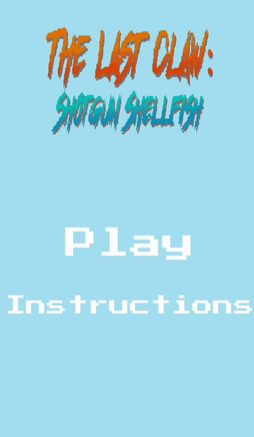
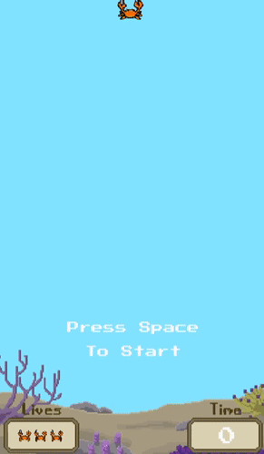

# The Last Claw Shotgun Shellfish

### DEVELOPERS

- Kenny Lazaro - Programmer
- Kevin Nguyen - Programmer, Producer
- Andrew Barrios - Artist
- Aaron Arthur Chin - Artist, Designer

### DESCRIPTION

- This Last Claw Shotgun Shellfish is a bullet hell type of game where the player's goal is to dodge the incoming projectiles, whether it be bubbles, urchins, or even other animals.
- Power-ups are present in the game, some may randomly spawn on the screen, and others may randomly spawn after killing an incoming enemy.
- Prior to the game, a menu will be present. Players are able to start the game or go through the instruction menu to see what each power-up does.
- There will be some UI present during the game to showcase how much time has elapsed (this will act as your score) and the amount of lives the player has left.
 

### FILE INFO

- [**Sprites**](https://github.com/k-lazaro/TheLastClawShotgunShellfish/tree/master/Assets/Sprites/Spritesheet) contains sprites of :
  - Power-ups (Extra life, Shotgun, Dual Guns, and Increased Fire Rate)
  - The main character, the crab
  - All spritesheets for the animations
  - Incoming projectiles
  - Incoming enemies
  - Title and UI
- [**Scripts**](https://github.com/k-lazaro/TheLastClawShotgunShellfish/tree/master/Assets/Sprites/Spritesheet) contains scripts of:
  - The crab and how it moves
  - Boundaries
  - Power-ups and what they provide
  - The enemies' spawn
  - Constantly updating UI
  - How projectiles travel
  - Music
 

### PLAY OUR GAME!

[**Click here to play!**](https://klazaro.itch.io/the-last-claw-shotgun-shellfish):

 

   
  <h2>Title Screen</h2>
  
   
   
  <h2>Gameplay</h2>
  
   
   
  <h2>End Screen</h2>
  
   
   
  <h2>Intense Gameplay</h2>
  

